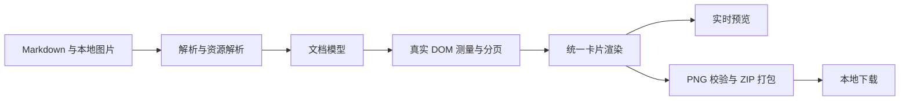

# md2card

> 面向技术内容的纯前端 Markdown 图片卡片生成器。把公式、表格、代码和本地图片排版成可连续阅读、可直接发布的 PNG 卡片。

[在线使用](https://haodongcui.github.io/md2card/) · [打开工作台](https://haodongcui.github.io/md2card/app/) · [完整能力示例](./examples/Md2Card%20Example.md)


`md2card` 适合把技术 Markdown 制作成小红书、知识笔记或长图卡片。它不上传文章，也不依赖后端：解析、图片绑定、真实分页、预览、PNG 生成和 ZIP 下载全部在当前浏览器完成。

## 为什么是 md2card

普通的 Markdown 转图片工具往往在公式、宽表格、本地图片或长文分页处失去控制。md2card 的目标不是“把网页截成图”，而是把技术笔记重新排成一组可读的卡片：普通正文保持阅读节奏，难处理的技术块有自己的缩放与续页规则。

| 关注点 | md2card 的处理方式 |
| --- | --- |
| 内容安全 | 没有账号、没有上传接口；GitHub Pages 只托管静态文件 |
| 本地图片 | 按 Markdown 相对路径匹配，只读取文章实际引用的图片 |
| 分页 | 使用与预览一致的真实 DOM 高度测量，不按字数估算 |
| 导出 | 预览与 PNG 共用同一份页面计划和卡片 DOM |
| 技术内容 | 公式、表格、代码独立缩放；表格和代码可安全续页 |

## 已实现

### 内容与资源

- [x] 粘贴、拖放或导入单篇 `.md` / `.markdown` / `.txt`。
- [x] 一键清空当前文章、附件与图片绑定，同时保留排版设置以便继续处理下一篇。
- [x] 标题、段落、强调、链接、列表、引用、行内代码和水平线。
- [x] GFM 表格、围栏代码、行内 / 展示数学公式和独立图片。
- [x] 首个 H1 自动作为文章名与可选首卡标题，正文不重复渲染。
- [x] 本地图片按完整相对路径、`./`、`../` 与目录后缀匹配。
- [x] 图片路径冲突明确提示，绝不静默随机绑定。
- [x] 图片管理器支持自动补齐、手动添加、显式绑定和资源清理。

### 阅读与排版

- [x] 3:4 标准卡片与 2:3 技术长图。
- [x] 融合首卡、独立封面与无封面三种首卡策略。
- [x] 纯净排版、雾蓝实验室、柔光浅紫、雾松笔记四套完整主题。
- [x] 舒展、技术平衡、紧凑三种密度预设，以及主题、画布、排版、内容四类细调。
- [x] 表格字号、公式缩放、代码字号独立控制，不连带缩小普通正文。
- [x] H2 / H3 / H4 分级页尾安全区与标题簇保护，避免标题孤立在页尾。
- [x] 超高表格按行续页并重复表头，长代码按行续页；图片与图注保持同块。
- [x] 手动分页标记 `<!-- md2card:break -->`，而 `---` 保持 Markdown 分隔线语义。

### 预览、导出与交付

- [x] 桌面端可拖动的编辑 / 设置 / 预览工作台；移动端分为编辑、设置、预览三个工作区。
- [x] 预览区按一、二、三列自动计算卡片缩放，默认双列。
- [x] 标准发布与高清原图两档 PNG，逐页打包为 ZIP。
- [x] 导出前检查 Markdown 诊断、字体、图片解码和卡片垂直溢出。
- [x] 对 PNG MIME 类型与文件头进行校验，避免下载损坏文件。
- [x] 草稿、配置、图片 Blob 与显式绑定关系保存到当前浏览器的 IndexedDB。
- [x] GitHub Actions 自动测试、构建并部署到 GitHub Pages。

## 立即试用

### 在线工作台

打开 [md2card 工作台](https://haodongcui.github.io/md2card/app/)，直接粘贴 Markdown 或导入一篇本地文件。默认的 **3:4 + 技术平衡 + 融合首卡** 已适合大多数技术笔记；遇到长公式或宽表格时，再进入“内容”细调即可。

### 导入项目自带样例

项目同时提供两层示例：首次打开工作台时，会看到一篇**不含本地图片、可直接预览多张卡片**的产品演示；仓库还提供一篇带三张 SVG 的完整资源样稿，用于体验真实文章的本地附件绑定。

完整资源样稿位于：

```text
examples/
├── Md2Card Example.md
└── images/
    ├── architecture.svg
    ├── sampling-pipeline.svg
    └── wide-matrix.svg
```

1. **下载整个 `examples` 文件夹或 Clone 仓库**，不要只下载其中的 `.md` 文件。
2. 导入 `Md2Card Example.md`；也可以将文件拖入编辑区。
3. 检测到图片引用后，选择 `examples` 目录；或在“管理图片”点击“自动补齐（选择图片所在文件夹）”。
4. 确认三张 SVG 都已绑定，分别尝试不同画布比例、密度与主题。
5. 使用标准发布和高清原图各导出一次，检查页序、图片和表格是否一致。

示例覆盖 H1 / H2 / H3、中文与英文混排、三张本地图片、行内与展示公式、宽表、长表、Python / TypeScript 代码、嵌套列表、长 URL、引用和显式分页。详见 [示例说明](./examples/README.md)。

## 本地运行

推荐 Node.js 22 或更高版本。

```bash
npm install
npm run dev
```

使用终端输出的本地地址访问网站，通常为 `http://localhost:5173`。不要直接双击 HTML 文件：`file://` 环境可能限制模块、字体和本地资源读取。

```bash
npm test       # 单元测试
npm run build  # 类型检查并构建 dist/
npm run preview
```

## 使用方式与关键细节

### 文章名、首卡与标题

文章名按以下优先级确定：手动填写的文章名 → 首个 H1 → 导入文件名 → `未命名笔记`。首个 H1 是文章元数据，会用于浏览器标题、草稿、ZIP 名称和可选首卡，因此不在正文重复渲染；后续 H1 仍视为章节起点。

分页不是按行数或字符数切割。应用会在屏幕外以与最终卡片相同的 CSS 测量内容，再生成页面计划。H2 / H3 / H4 拥有独立的页尾安全区，标题会携带必要的上下文移动；H2 还会尽量带上短引言之后的实质内容。安全区与 H2 / H3 段前留白都可以在“标题”设置中调整。

| 内容 | 处理策略 |
| --- | --- |
| 普通段落 | 保持正文宽度、字号、行距与块间距 |
| 宽表格 | 单独使用表格字号；超高时按行续页并重复表头 |
| 长公式 | 单独缩放；特别复杂时建议使用 `aligned` 等多行写法 |
| 长代码 | 独立字号、可选 macOS 代码块外观；按源代码行续页 |
| 图片 | 在安全区内 `contain` 缩放，图片和图注不拆开 |
| 明确换页 | 写入单独一行 `<!-- md2card:break -->` |

### 本地图片为什么需要再选一次文件夹

Markdown 只保存路径，例如：

```markdown

```

单独选择 `.md` 文件后，浏览器没有该文件父目录的操作系统权限。这是浏览器的安全模型，不是 md2card 的限制。检测到本地图片引用时，选择文章根目录或 `assets` 文件夹即可：应用先索引相对路径和文件名，再只读取当前文章实际引用到的图片，不会把整个目录都导入草稿。

| 操作 | 适用场景 | 行为 |
| --- | --- | --- |
| 自动补齐（选择图片所在文件夹） | Markdown 已有缺失或冲突的图片引用 | 选择文章根目录或 `assets`，按路径匹配实际引用 |
| 手动添加图片 | 无目录权限、替换图片、处理冲突 | 多选图片；选中某个引用时直接建立显式绑定 |

完整相对路径优先。存在同名候选或相同路径后缀时，状态会显示为“路径冲突”，需要在图片管理器中确认；原 Markdown 不会被自动改写。远程图片由浏览器直接请求其来源站点，若来源不允许 CORS 访问，导出前检查会提示失败。

### 导出

| 选项 | 3:4 | 2:3 | 建议 |
| --- | ---: | ---: | --- |
| 标准发布 | 1080 × 1440 | 1080 × 1620 | 常规发布，速度更快、文件更小 |
| 高清原图 | 2160 × 2880 | 2160 × 3240 | 公式、表格放大查看或留存 |

导出前会等待字体和图片加载，并检查 Markdown 警告、图片状态和卡片边界。通过后，预览当前所见的同一份卡片 DOM 会逐页生成 PNG，并被打包成 ZIP。长文或高清导出会使用更多浏览器内存，请在导出时保持页面打开。

## Markdown 支持

| 类型 | 支持 |
| --- | --- |
| 标题 | `#` 至 `######` |
| 基础文本 | 段落、粗体、斜体、删除线、链接、行内代码、换行 |
| 列表与引用 | 有序 / 无序 / 嵌套列表，引用块 |
| 表格 | GFM 表格及列对齐 |
| 代码 | 围栏代码；Python、Bash、JSON、TypeScript、JSX、TSX 高亮，其余语言降级为纯文本 |
| 数学 | `$...$`、`$$...$$`、`\(...\)`、`\[...\]` |
| 图片 | 独立图片块 ``；图片标题优先作为图注，未填写时使用替代文本 |
| 图注与表注 | 图片 / 表格后紧随 `图 1：说明` 或 `表 1：说明` 时，会自动归入前一个内容块并与其同页 |
| 分隔线 | `---` |

为保证导出安全与一致，原始 HTML 会被忽略。内联图片、复杂 HTML 混排、脚注和 Mermaid 暂不属于稳定支持范围；复杂宽表和极长公式建议优先做内容拆分或使用 2:3 技术长图。

## 隐私与浏览器支持

| 数据 | 存放与处理方式 |
| --- | --- |
| Markdown 与排版设置 | 当前浏览器内存与 IndexedDB 草稿 |
| 本地图片 | 浏览器内存、Object URL 与 IndexedDB Blob |
| PNG / ZIP | 在浏览器生成并下载到本机 |
| GitHub Pages | 只托管 HTML、CSS、JavaScript、字体和静态资源 |
| GitHub Actions | 只安装依赖、测试、构建和部署代码，不处理用户文章 |

最新版桌面 Chrome / Edge 是完整支持平台，尤其适合目录索引与稳定导出。手机浏览器可编辑和预览，但高清长文导出受内存限制；Safari / Firefox 可进行基础预览，暂不承诺完全一致的导出结果。清除本站点数据会清除该浏览器保存的草稿和导入图片。

## 技术架构



| 层级 | 技术 | 责任 |
| --- | --- | --- |
| 应用 | Vite、Preact、TypeScript | 静态应用与交互 |
| 解析 | unified、remark-parse、remark-gfm、remark-math | Markdown AST 与数学语法 |
| 公式与代码 | KaTeX、Prism | 公式、语法高亮 |
| 分页 | `MeasureStage` + DOM 高度 | 基于真实卡片尺寸的页面计划 |
| 本地资源 | File System Access API、目录选择器、Object URL | 图片路径解析与绑定 |
| 存储 | IndexedDB | 草稿、配置、图片 Blob、显式绑定 |
| 导出 | html-to-image、fflate | PNG 生成、校验与 ZIP 打包 |
| 交付 | GitHub Pages、GitHub Actions | 静态部署 |

`parser` 只处理内容结构，`layout` 只生成分页计划，`renderer` 是唯一生成卡片 DOM 的位置，`export` 只导出已渲染卡片，`app` 负责界面和状态编排。这个边界让预览与导出避免各自重新解析、重新分页。

## 项目结构

```text
md2card/
├── .github/workflows/       # 测试、构建与 GitHub Pages 部署
├── app/                      # /app/ 工作台入口
├── examples/                 # 可直接导入的复杂 Markdown 与本地图片
├── public/                   # favicon、OG 封面、robots、sitemap
├── src/
│   ├── app/                 # 状态与交互编排
│   ├── domain/              # 文档、分页和排版类型
│   ├── export/              # PNG、校验、ZIP 下载
│   ├── layout/              # DOM 测量与分页规则
│   ├── parser/              # Markdown 解析与规范化
│   ├── renderer/            # 卡片、封面和富文本渲染
│   ├── resources/           # 本地图片索引、绑定与状态
│   ├── storage/             # IndexedDB 草稿仓储
│   └── styles/              # 工作台、网站与卡片主题样式
└── tests/                    # 解析、分页和资源绑定回归测试
```

## 部署到 GitHub Pages

仓库自带 [部署工作流](./.github/workflows/deploy.yml)。推送到 `main` 时会使用 Node.js 22，依次安装依赖、运行测试、构建 `dist/` 并部署。首次部署时，在仓库 **Settings → Pages** 将 Source 设为 **GitHub Actions**。

Vite 使用相对资源路径，因此同一份构建产物可部署到 GitHub Pages 项目路径、其他静态托管服务或任意本地 HTTP 服务器，无需为仓库名修改基址。站点地图只收录产品首页，工作台声明为 `noindex`。

## 质量检查

当前测试覆盖以下容易回归的场景：GFM 表格分隔线不会被当成分页；数学公式可正确解析；超高表格和代码可以续页；标题簇与页尾安全区会生效；封面、页码与首卡容量保持正确；本地图片按相对路径绑定且同名冲突不误绑。

修改分页、公式、导出或资源逻辑后，至少运行：

```bash
npm test
npm run build
```

视觉改动还应使用 [完整能力示例](./examples/Md2Card%20Example.md)，在 Chrome / Edge 中人工检查表格、长公式、多级标题、代码和三张本地图片的预览与导出。

## License

本项目采用 [MIT License](./LICENSE)。代码可自由使用、修改、分发和商业化，但须保留版权声明与许可证文本。项目名称、Logo 与展示素材不自动授予商标或品牌使用权。
