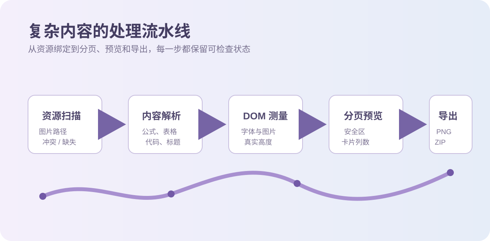
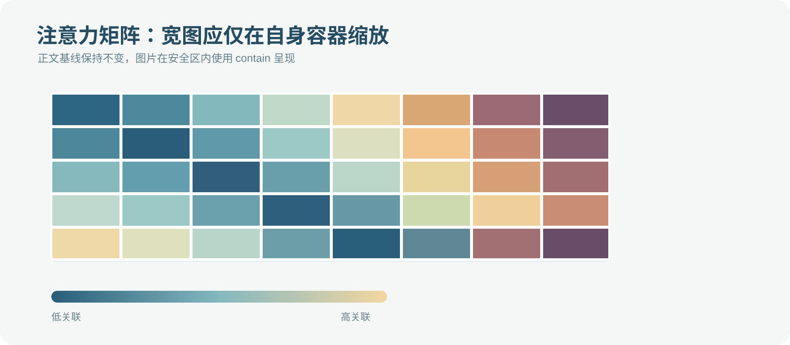

# md2card 产品能力演示：把技术 Markdown 变成可发布卡片

> **这是可直接导入的完整样例。** 导入本文件后，选择 `complex-markdown` 文件夹，或在“管理图片”中点击“自动补齐（选择图片所在文件夹）”。三张 SVG 应显示为“已绑定 3 / 3”。本篇刻意包含图片、公式、宽表、长表、代码、标题簇与手动分页，用于检查完整导出链路。

md2card 是一个纯前端的 Markdown 图片卡片工作台：**文章不上传、预览即导出、技术内容独立排版**。下面这篇产品说明本身也是一份复杂排版压力测试，适合用来体验 3:4 标准卡片、2:3 技术长图，以及不同主题与密度下的阅读节奏。

## 01 · 多图片与相对路径绑定

这段文字混合了中文、English technical terms、**强调内容**、`inline_code()`、[项目主页](https://github.com/haodongcui/md2card) 与行内公式 $\mathrm{SNR}=10\log_{10}(P_s/P_n)$。它用于观察中英文基线、链接、强调与段落间距是否保持稳定。


图 1 展示从 Markdown AST、分页器到 PNG ZIP 的完整闭环。图片引用使用 `./images/architecture.svg`，用于验证完整相对路径匹配。

### 01.1 · 这篇样例覆盖什么

| 资源类型 | 示例来源 | 渲染策略 | 重点检查 |
| --- | :---: | ---: | --- |
| Markdown | `复杂排版与资源回归样例.md` | remark + GFM | H1 元数据、H2/H3 标题簇 |
| 本地图片 | `images/architecture.svg` | Blob Object URL | 相对路径、图注与 `contain` |
| 展示公式 | KaTeX | 原子块 | 缩放、换页与边界 |
| 长表格 | GFM table | 固定列宽 | 行内折行、续页与表头 |
| 代码块 | Python / TypeScript | Prism | 长行、语言名和行号 |



图 2 故意省略开头的 `./`，应仍通过目录后缀匹配到同一图片文件夹。若存在同名候选，图片管理器会保留冲突而不是随机选择。

## 02 · 公式、正文与长符号

设前向扩散过程为 $q(x_t\mid x_{t-1})=\mathcal{N}(\sqrt{1-\beta_t}x_{t-1},\beta_tI)$，并令 $\bar\alpha_t=\prod_{s=1}^{t}(1-\beta_s)$。在真实技术笔记中，公式常与中文解释、缩写、链接和括号混排，因此这里故意保留较长的一段说明。

$$
\begin{aligned}
x_t &= \sqrt{\bar\alpha_t}\,x_0 + \sqrt{1-\bar\alpha_t}\,\epsilon,\qquad \epsilon\sim\mathcal{N}(0,I),\\
\mathcal{L}_{\mathrm{simple}} &= \mathbb{E}_{t,x_0,\epsilon}\left[\left\|\epsilon-\epsilon_\theta\!\left(\sqrt{\bar\alpha_t}x_0+\sqrt{1-\bar\alpha_t}\epsilon,t\right)\right\|_2^2\right].
\end{aligned}
$$

下面是一个较长的行内表达式，用于检查不会挤压普通正文：$\operatorname{KL}(q(x_{t-1}\mid x_t,x_0)\Vert p_\theta(x_{t-1}\mid x_t))$。如果公式本身过长，应优先缩放公式块，而非缩小整张卡片的正文。

> 设计提醒：正文、标题和技术块应各自控制缩放。为了容纳一条公式而把整页字体缩小，会破坏信息层级，也会让小红书阅读体验变差。

## 03 · 宽表格、长表格与续页

| 步骤 | 张量形状 | 时间复杂度 | 数值稳定性 | 常见错误 | 推荐检查 |
| --- | --- | --- | --- | --- | --- |
| 读取 Markdown | $O(L)$ | $O(L)$ | 高 | 图片路径含空格或编码 | 检查本地图片状态 |
| 解析 AST | 节点数 $N$ | $O(N)$ | 高 | GFM 表头缺失 | 检查表格分隔行 |
| DOM 测量 | 卡片宽度固定 | $O(N)$ | 中 | 字体尚未加载 | 等待 `document.fonts.ready` |
| 标题分页 | H2/H3 簇 | $O(N)$ | 高 | 标题孤立在页尾 | 调整页尾安全区 |
| 图片测量 | 原图比例 | $O(I)$ | 中 | 本地 Blob 丢失 | 在管理图片中自动补齐 |
| PNG 导出 | $1080\times1440$ | 与像素数相关 | 中 | 远程 CORS 图片失败 | 使用本地图片或可访问 URL |

下表有较多行，用于触发表格按行续页与重复表头。每一行都包含不同长度的文字，便于观察固定列宽、自动换行和上下留白。

| 编号 | 实验设置 | 观察现象 | 结论 |
| ---: | --- | --- | --- |
| 01 | 3:4、技术平衡、单图 | 首卡标题与图片可共存 | 适合短笔记 |
| 02 | 2:3、舒展密度、长公式 | 公式需要更多纵向空间 | 适合推导过程 |
| 03 | 3:4、紧凑、长表格 | 表格会拆分为多页 | 表头应在续页保留 |
| 04 | H2 位于页尾 25% | 标题簇整体后移 | 避免章节断裂 |
| 05 | H3 位于页尾 10% | 三级标题保护更弱 | 减少不必要空白 |
| 06 | 自动补齐图片附件 | `images/*.svg` 精确绑定 | 优先使用相对路径 |
| 07 | 两个同名 `diagram.png` | 显示路径冲突 | 不允许静默误绑 |
| 08 | 手动多选图片 | 仅唯一文件名可兜底 | 适合少量图片 |
| 09 | macOS 代码块 | 窗口栏与白色代码区 | 适合展示代码 |
| 10 | 深紫工作台 | 不影响导出卡片 | 网页主题与卡片分离 |
| 11 | 高清原图导出 | 公式和表格更清晰 | 文件更大、速度更慢 |
| 12 | 长 URL | 允许视觉换行 | 原始链接不应被破坏 |

## 04 · 代码、列表与长 URL

```python
from dataclasses import dataclass

@dataclass(frozen=True)
class CardPlan:
    page_index: int
    title: str
    estimated_height: float

def choose_preview_columns(card_count: int, available_width: float) -> int:
    """Keep a card readable before filling every empty pixel."""
    minimum_card_width = 270
    if card_count <= 1 or available_width < minimum_card_width * 2:
        return 1
    return 2 if available_width < minimum_card_width * 3 else 3
```

1. 先确认 Markdown 的首个 H1 是否应作为文章名，并试试融合首卡或独立封面。
2. 再通过“管理图片 → 自动补齐（选择图片所在文件夹）”检查本地资源状态。
   - `images/architecture.svg` 应精确匹配；
   - 同名图片冲突应在图片管理窗口中可见；
   - 缺失图片不应在导出时悄悄变成空白。
3. 最后调整画布、标题分页与技术块参数，再导出 PNG ZIP。

可以使用这个很长的链接检查视觉折行：<https://example.com/research/diffusion-models/very-long-path-with-many-segments?resolution=2160x2880&theme=research&export=zip#image-resource-binding>。

<!-- md2card:break -->

---

## 05 · 手动分页后的图片与收尾



图 3 用较宽的矩阵图验证图片在安全区内以 `contain` 方式缩放，而正文宽度和字号不随图片变化。

```typescript
type BindingState = 'matched' | 'missing' | 'ambiguous';

export function summarizeBindings(states: BindingState[]) {
  return states.reduce(
    (summary, state) => ({ ...summary, [state]: summary[state] + 1 }),
    { matched: 0, missing: 0, ambiguous: 0 },
  );
}
```

最后一段用于验证末页留白：不需要为了填满画面而拆散图片图注、代码行、表格行或标题簇。读者能快速理解内容结构，比机械地塞满每一张卡片更重要。

> **导出前检查建议**：确认三张图片均已绑定，再分别以标准发布与高清原图导出一次。两种导出的页序、版式和内容应一致，区别只在像素尺寸与文件体积。
